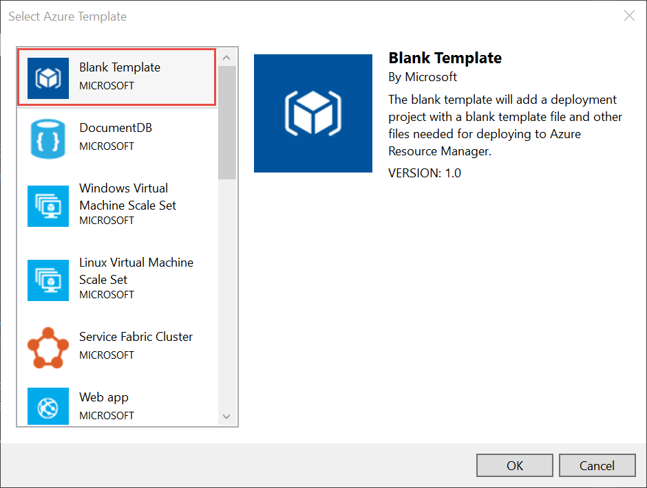
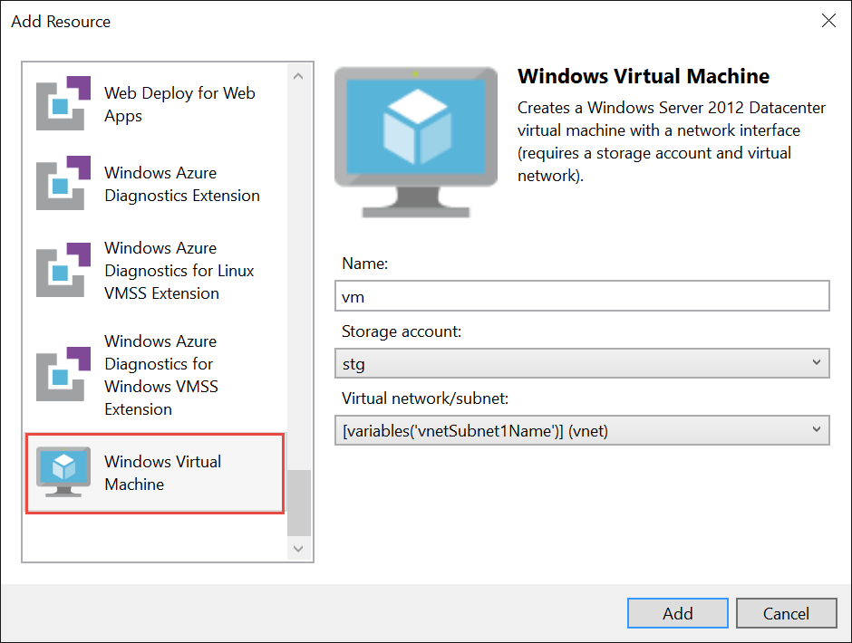
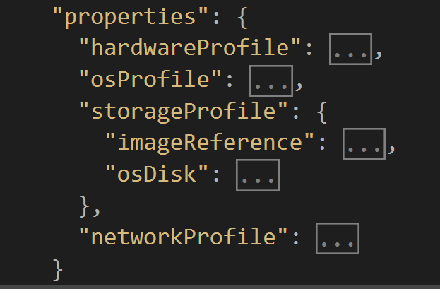
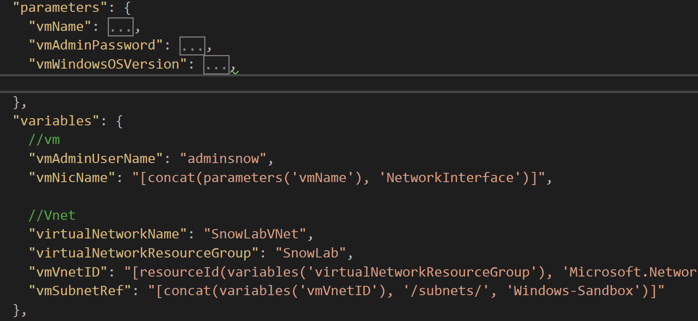
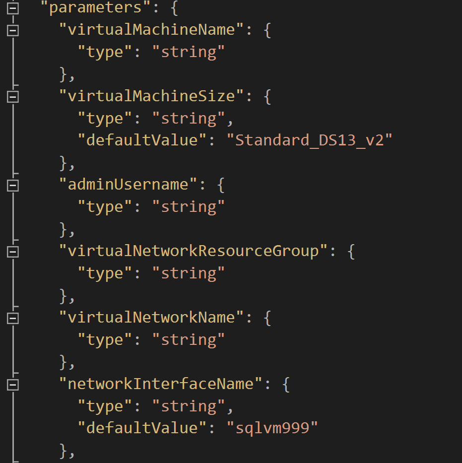

# Infrastructure as Code Lab

## 2nd in the Series
This lab assumes you have completed the earlier IaaS lab https://aka.ms/armlab
It takes you to a point when you have a single VM deployed in a new vnet, using a storage account for disk storage.

## Learning Objectives

1. Working with existing Azure resources

1. Introduction to managed disks instead of storage accounts for VM disk storage

1. Advanced use of parameters to capture the right level of detail

1. Using conditional logic

1. Best practice use of variables

1. Nested templates

1. Passing parameters to nested templates

1. Conditionally installing services

**Estimated time to complete this lab: *120* minutes**

# Exercise 1 : Add a VM to an existing template

1. In the Azure Portal, create a virtual network in a new Resource Group.

1. Create two subnets, "Windows-Sandbox" and "Linux-Sandbox"

1. In Visual Studio, create a new *Azure Resource Group* project and proceed using a **Blank Template** and click **OK**.

    

1. In the **JSON Outline** window, right-click **Resources** and select **Add New Resource**.

1. In the **Add Resource** window, select **Windows Virtual Machine**.

    - Set the resource **Name** to *vm*.

    - For the **Storage account**, select create new and name it *tmpstorage*, we will be removing this reference from the template in a later step.

    - Select from the **Virtual network/subnet** dropdown the Virtual Network that you created in the portal, and the *Windows subnet*

    - Click **Add**.

    


1. In the editor window for azuredeploy.json, find the definition for the osDisk.  Replace it with this statement.

    ```json
        "osDisk": {
            "createOption": "FromImage",
            "managedDisk": {
              "storageAccountType": "Standard_LRS"
            }
          },
    ```
    Your properties section structure should look like this;
     

1. We need to change the API version for the *Virtual Machine*  because the older API versions don't know about managed disks.  
    ```json
        "apiVersion": "2016-04-30-preview"  

1. Now remove all references to the storage account from the template as it is no longer needed.  In the JSON Outline, search for *tmpstorage* and remove the service as well as all references to it. 

1. Add *2016-Datacenter* to the parameter list of Windows OS Versions and make it the default

1. Now we want tor reduce the list of template parameters to just being the ones we want the user to supply which are;
    1. vmName
    1. vmAdminPassword
    1. vmWindowsOSVersion

    For all the other Parameters you should *move* to the variables section.
    You'll do this by creating variables with the same name, then changing the reference to them throughout the template from parameters('name') to variables('name')

    You should have something that looks like this
     

1. At this stage several changes have been made, all of which we haven't tested out by deploying the VM.  Therefore we should deploy the VM to Azure and make sure creation completes successfully before proceeding too far.

# Exercise 2 : Parameters

1. Add a new parameter to allow the user to select the VmSize

    ```json
    "VmSize": {
      "type": "string",
      "defaultValue": "Small",
      "allowedValues": [
        "Small",
        "Large"
      ]
    }
    ...

1. Add a variable to interpret the t-shirt size parameter to the appropriate Azure VM size
    ```json
        "vmVmSize": "[if(equals(parameters('VmSize'), 'Small'), 'Standard_A0', 'Standard_D2_V2')]",
    ...

1. Change the VMName parameter and deploy to Azure again.

1. Extend the VmSize Parameter to have a third option 

    ```json
        "VmSize": {
            "type": "string",
            "defaultValue": "Small",
            "allowedValues": [
                "Small",
                "Medium",
                "Large"
            ]
            }
    ...

1. Add a new Variable that will help us translate between the friendly VM Size value and the actual Azure VM Size we need for the template.

    ```json
        "VmShirtSize": {
            "Small": "Standard_A0",
            "Medium": "Standard_A3",
            "Large": "Standard_D2_V2"
        }
    ...

1. Now we can changed the *vmVmSize* variable, replacing the If statement with something a little more clever.

    ```json
        "vmVmSize": "[Variables('VmShirtSize')[Parameters('VmSize')]]"
    
1. Deploy the VM again selecting a different T-Shirt size, watching the existing VM resize.

# Exercise 3 : Nested templates

1. Create a folder within your *Resource Group Project* called *nested*

1. Download the file from here: https://raw.githubusercontent.com/Gordonby/ArmLab2/master/scripts/Ex3/nested/Shutdown.json and put it in the *nested folder*

1. If you examine the file, you'll see it's exactly the same template format that you're used to.  This template takes 1 parameter, the *Virtual Machine Name* and creates a scheduled shutdown of it at 7pm.  

1. Add the variable *nestedTemplateRoot* in the variables section.  
    As Nested Templates will be pulled by the Azure API they need to be publically accessible.  We'll specify the root path once in the Variables section that can be used by any/all of the Nested Templates we end up referencing from this template.

    ```json
        "nestedTemplateRoot": "https://raw.githubusercontent.com/Gordonby/ArmLab2/master/scripts/Ex3/nested/"


1. In order to call this template from our main template file, we have to add a resource of *Microsoft.Resources/deployments*
    Add the resouce to your template, noticing that we're 
    1. Passing a parameter down to the template for the VM Name that comes from the main template Parameters
    1. Specifying a variable to be used as the path to the Nested Template.  This could be a local path or an http one.

    ```json
        {
            "apiVersion": "2017-05-10",
            "name": "Shutdown-policy",
            "type": "Microsoft.Resources/deployments",
            "properties": {
                "mode": "incremental",
                "templateLink": {
                "uri": "[concat(variables('nestedTemplateRoot') ,'Shutdown.json')]",
                "contentVersion": "1.0.0.0"
                },
                "parameters": {
                    "virtualMachineName": { "value": "[parameters('vmName')]" }
                }
            },
            "dependsOn": [
                "[resourceId('Microsoft.Compute/virtualMachines', parameters('vmName'))]"
            ]
        }

    Notice that in the parameter block we're using the parameter name from the nested template, and giving it a specific value which just so happens to align to an existing Paramter in our master template.  It could quite easily have been a variable or a string constant.

1. Deploy to Azure, using a new VM Name and checking afterwards to make sure the Shutdown Policy service has been created

# Exercise 4 : Conditional Services - Load Balancer (ILB)

A common activity is needing to only deploy certain Azure services, based on parameter input.  In this exercise, we will explore this using a load balancer as an example.

1. Add a new parameter called *Environment* which will ultimately inform the decision to create certain resources and configuration.

    ```json
        "Environment": {
            "type": "string",
            "defaultValue": "Dev",
            "allowedValues": [
                "Dev",
                "Pre-Prod",
                "Prod"
            ]
        }

1. Add a Load Balancer resource to the template.  Notice the first propery, *Condition*.  We use this to check the value of the Environment parameter.  If it is "Prod" then *true* is returned and the resource will be deployed.

    ```json
        {
            "condition": "[equals(parameters('Environment'), 'Prod')]",
            "apiVersion": "2015-05-01-preview",
            "type": "Microsoft.Network/loadBalancers",
            "name": "[variables('loadBalancerName')]",
            "location": "[resourceGroup().location]",
            "dependsOn": [

            ],
            "properties": {
                "frontendIPConfigurations": [
                {
                    "properties": {
                    "subnet": {
                        "id": "[variables('vmSubnetRef')]"
                    },
                    "privateIPAllocationMethod": "Dynamic"
                    },
                    "name": "LoadBalancerFrontend"
                }
                ],
                "backendAddressPools": [
                {
                    "name": "BackendWebPool"
                }
                ],
                "loadBalancingRules": [
                {
                    "properties": {
                    "frontendIPConfiguration": {
                        "id": "[concat(resourceId('Microsoft.Network/loadBalancers', variables('loadBalancerName')), '/frontendIpConfigurations/LoadBalancerFrontend')]"
                    },
                    "backendAddressPool": {
                        "id": "[concat(resourceId('Microsoft.Network/loadBalancers', variables('loadBalancerName')), '/backendAddressPools/BackendWebPool')]"
                    },
                    "probe": {
                        "id": "[concat(resourceId('Microsoft.Network/loadBalancers', variables('loadBalancerName')), '/probes/lbprobe')]"
                    },
                    "protocol": "Tcp",
                    "frontendPort": 80,
                    "backendPort": 80,
                    "idleTimeoutInMinutes": 15
                    },
                    "Name": "lbrule"
                }
                ],
                "probes": [
                {
                    "properties": {
                    "protocol": "Tcp",
                    "port": 80,
                    "intervalInSeconds": 15,
                    "numberOfProbes": 2
                    },
                    "name": "lbprobe"
                }
                ]
            }
            }

1. In the variables section, lets add a object which will contain the configuration for the Load Balancer Address Pools.  By using variables to store Objects, rather than plain strings we make its purpose simpler to understand and easier to implement in the resource part of the template.

    ```json
        //load balancer
        "loadBalancerName": "lb",
        "loadBalancerConfig": {
            "None": [],
            "Configured": [
                {
                "id": "[concat(resourceId('Microsoft.Network/loadBalancers', variables('loadBalancerName')), '/backendAddressPools/BackendWebPool')]"
                }
            ]
        }

1. In the *NIC config* add a dependsOn statement to ensure the NIC will wait for the Load Balancer to be created first.
    ```json
    "dependsOn": [
        "[resourceId('Microsoft.Network/loadBalancers', variables('loadBalancerName'))]"
    ],

1. In the *NIC config* add the lb config directly under the subnet definition

    ```json
        "subnet": {
            "id": "[variables('vmSubnetRef')]"
            },
        "loadBalancerBackendAddressPools": "[if(equals(parameters('Environment'), 'Prod'),variables('loadBalancerConfig').Configured,variables('loadBalancerConfig').None)]"

1. Deploy with a new VM Name parameter value using the Environment *Prod*, inspect the created resouces in the Azure Portal.

1. Deploy with a new VM Name parameter value using the Environment *Dev*, inspect the created resouces in the Azure Portal.

# Exercise 5 : Conditional Services - Availability Set

1. Add a variable for the Availability set name
    ```json
    //Availability set
    "availabilitySetName": "webAvailSet",

1. Add another variable for the Availability set Id that we will conditionally use in the template
    ```json
    "availabilitySetId": {
      "id": "[resourceId('Microsoft.Compute/availabilitySets', variables('availabilitySetName'))]"
    },

1. Add the availability set resouce definition
    ```json
    {
      "condition": "[equals(parameters('Environment'), 'Prod')]",
      "name": "[variables('availabilitySetName')]",
      "type": "Microsoft.Compute/availabilitySets",
      "apiVersion": "2016-04-30-preview",
      "location": "[resourceGroup().location]",
      "properties": {
        "platformFaultDomainCount": 2,
        "platformUpdateDomainCount": 3,
        "managed": true
      }
    }

1. Explicitly tell the VM it depends on the Availability Set.  Whether or not we are deploying the Availability Set, we need to make sure that it will be there before the VM.  Because the Availability Set is conditional, this will work just fine.
    ```json
    "dependsOn": [
        "[resourceId('Microsoft.Compute/availabilitySets/', variables('availabilitySetName'))]"

1. Add a property to the VM (properties section) to conditionally use the Availability Set
    ```json
    "properties": {
        "availabilitySet": "[if(equals(parameters('Environment'), 'Prod'), variables('availabilitySetId'), json('null'))]",
 

1. Deploy with a new VM Name parameter value using the Environment *Prod*, inspect the created resouces in the Azure Portal.

1. Deploy with a new VM Name parameter value using the Environment *Dev*, inspect the created resouces in the Azure Portal.

# Exercise 6 : SQL Server

In this excercise we're going to create another VM, this time a SQL Server VM based on the SQL Server 2016 image from the Azure Marketplace.

1. In the Azure Portal, follow the steps to create a SQL Server VM from this point - making sure to reference the existing Virtual Network and subnet that our other Windows VM uses. 
    https://ms.portal.azure.com/#create/Microsoft.SQLServer2016SP1StandardWindowsServer2016-ARM
    Alternatively, choose any of the SQL images and proceed to complete the configuration information, halting before you hit the create button.  Instead look at the template script link and copy out the json template into a new json file in the Nested folder which you should call *SqlIaaS.json*

    Click on the parameters section inside the portal and copy & paste it into a text editor where we can reference it later.

    Now that you've extracted what the portal would have done to create the SQL VM, lets move it around a little and call this template from our other template.

1. Remove the location parameter

1. Do a search and replace for *parameters('location')* with *resourceGroup().location*

1. In the Nic Configuration the resouce group name is hardcoded from when the template was scripted.  Replace the PublicIP property with the one defined below
    ```json
    "publicIpAddress": {
        "id": "[resourceId(resourceGroup().name,'Microsoft.Network/publicIpAddresses', parameters('publicIpAddressName'))]"
    }

1. Go through and add default values for each parameter, with the default based on the parameter values in your text editor for just these parameters;
    1. virtualMachineSize
    1. networkInterfaceName
    1. publicIpAddressName
    1. publicIpAddressType
    1. publicIpAddressSku
    1. autoShutdownStatus
    1. autoShutdownTime
    1. autoShutdownTimeZone
    1. autoShutdownNotificationStatus
    1. sqlConnectivityType
    1. sqlPortNumber
    1. sqlStorageDisksCount
    1. sqlStorageWorkloadType
    1. sqlStorageDisksConfigurationType
    1. sqlStorageStartingDeviceId
    1. sqlStorageDeploymentToken
    1. sqlAutopatchingDayOfWeek
    1. sqlAutopatchingStartHour
    1. sqlAutopatchingWindowDuration
    1. rServicesEnabled

    After you're finished the parameters should look something like this.
     
    
1. Add a new parameter for the Virtual Network Resource Group Name
    ```json
    "virtualNetworkResourceGroup": {
      "type": "string"
    },

1. Change the variable VNetId to
    ```json
    "vnetId": "[resourceId(parameters('virtualNetworkResourceGroup'),'Microsoft.Network/virtualNetworks', parameters('virtualNetworkName'))]",

1. Now we're ready to consume this template in the main tempalte
    ```json
        {
      "apiVersion": "2017-05-10",
      "name": "SqlVM",
      "type": "Microsoft.Resources/deployments",
      "properties": {
        "mode": "Incremental",
        "templateLink": {
          "uri": "[concat(variables('nestedTemplateRoot') ,'SqlIaaS.json')]",
          "contentVersion": "1.0.0.0"
        },
        "parameters": {
          "virtualMachineName": { "value": "[parameters('vmName')]" },
          "virtualMachineSize": {"value": "Standard_DS13_v2"},
          "adminUsername": { "value": "[variables('vmAdminUserName')]" },
          "virtualNetworkResourceGroup": { "value": "[variables('virtualNetworkResourceGroup')]" },
          "virtualNetworkName": { "value": "[variables('virtualNetworkName')]" },
          "adminPassword": { "value": "[parameters('vmAdminPassword')]" },
          "subnetName": { "value": "[variables('vmSubnetRef')]" }
        }
      },
      "dependsOn": [

      ]
    }

    Pay specific attention to the parameters block.  We're passing just the variables that we didn't associate a default value with in an earlier step.

1. Deploy!

# Exercise 7 : Network Security Groups

1. Create an NSG for the web VM

1. Create an NSG for the SQL VM

1. Allow 1433 between the web and SQL

# Exercise 8 : Domain joining with Powershell DSC

1. Deploy a domain controller

# Exercise 9 : Web tier

1. Add project name paramter

1. Change the naming of the load balancer and availability set to use the project name

1. Add a second web server

1. Install IIS with DSC

1. Install new website that reads from a SQL Db.

1. Add public IP

1. Add public load balancer

1. Deploy
